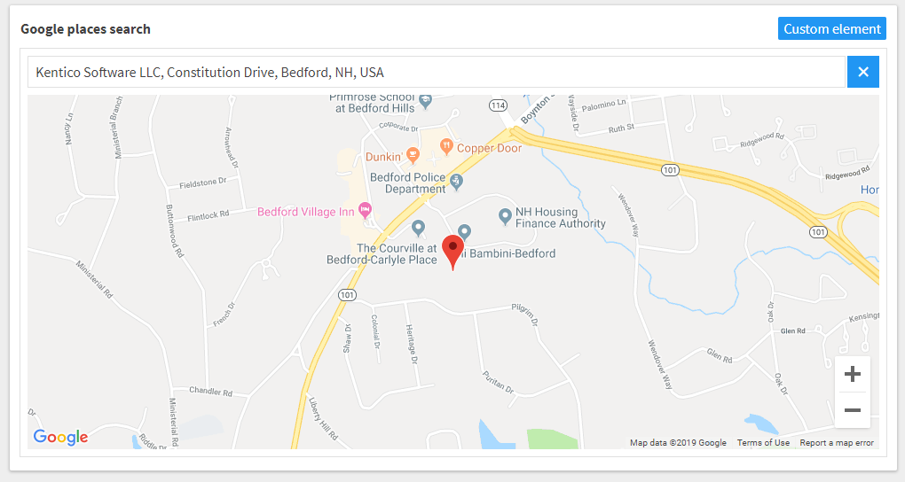

# Google Places Geo-location Selector Kentico Cloud Custom Element

This is a [custom element](https://developer.kenticocloud.com/docs/integrating-content-editing-features) for [Kentico Cloud](https://kenticocloud.com) that allows users to easily get the geo-coordinates for a location using the Google Places API.



## Quick Setup (for testing)

You can get started quickly using the currently version currently deployed to GitHub Pages. I do not recommend using this for anything other than **quick testing only**.

1. [Get Google API keys](#getting-api-keys)
1. Follow the instructions in the [Kentico Cloud documentation](https://developer.kenticocloud.com/docs/integrating-content-editing-features#section-3-displaying-a-custom-element-in-kentico-cloud) to add the element to a content model using <https://kentico.github.io/custom-element-samples/GooglePlacesSearch/> as the `Hosted code URL` and pass your configuration details via [JSON Parameters configuration](#json-parameters).

## JSON Parameters

`googleApiKey` is your API key from Google.

`center` is the latitude and longitude for the center of the map when no place is selected.

```Json
{
  "googleApiKey": "YOUR_GOOGLE_API_KEY",
  "center": {
    "lat": -25.344,
    "lng": 131.036
  }
}
```

## What is Saved?

The JSON object returned from the Deliver API matches the following signature:

```Json
{
  "name" : "15 Constitution Dr #2g, Bedford, NH 03110, USA",
  "position": {
    "lat":42.9546464,
    "lng":-71.50468160000003
  }
}
```

## Getting API Keys

This custom element requires the use of Google's places and maps APIs. Follow the [instructions in Google's documentation](https://developers.google.com/places/web-service/get-api-key) to get a proper key.

## Developing
The Google Places Search element source code is available in [this repository](https://github.com/christopherjennings/google-places-search-element).

If you want to adjust the implementation, first download [Kentico Cloud Custom Elements Devkit](https://github.com/kentico/custom-element-devkit). Source code of this selector needs be positioned within `/client/custom-elements` folder. For further instructions on devkit implementation, please refer to [Custom Element Devkit README](https://github.com/Kentico/custom-element-devkit/blob/master/readme.md).


