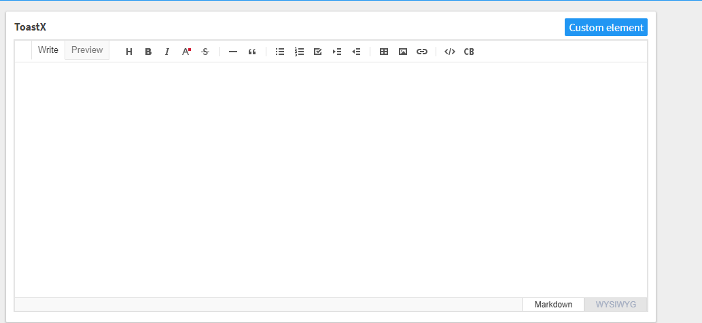

# Kentico Kontent Toast UI editor custom element

Toast UI editor is based on [Toast UI Editor](https://ui.toast.com/tui-editor). It is a Markdown WYSIWYG Editor including GFM Standard + Chart & UML Extensible.
All of the editor [extensions](https://github.com/nhnent/tui.editor/blob/master/docs/using-extensions.md) are enabled in this custom element.



## Usage

If you want to use the Toast UI editor in your project in Kentico Kontent, follow these steps:

* In Kentico Kontent open Content types tab
* Open / create a content model to which you want to add the Toast UI Editor
* Add **Custom element** content element
* Open configuration of the content element
* Use following URL as Hosted code URL (HTTPS): https://kentico.github.io/kontent-custom-element-samples/KCTuiEditor/index.html

### Output

```json
{
  "item": {
    "system": {  },
    "elements": {
      "toast": {
        "type": "custom",
        "name": "Toast",
        "value": "Hi @Kentico/global-collaborators!\n\nWe bring you another batch of Kentico developer news.\n\n## Bynder integration tutorial\n\nThere is a new tutorial describing how to integrate Kentico Kontent with Digital Asset Management platform (DAM). In this case it is a [Bynder](https://www.bynder.com/en/)."
      }
    }
  },
  "modular_content": {}
}
```

## Installation

Toast UI editor is in repository: https://github.com/Simply007/kc-tui-editor-custom-element.

If you want to adjust the implementation, first download [Kentico Kontent Custom Elements Devkit](https://github.com/kentico/custom-element-devkit). This repository should be positioned within `/client/custom-elements` folder. For further instructions on devkit implementation, please refer to [Custom Element Devkit README](https://github.com/Kentico/custom-element-devkit/blob/master/readme.md).

### Get started

You could use following commands to set up the development environment

Prerequisites:

* Node.js
* git

```plain
git clone https://github.com/Kentico/custom-element-devkit.git
cd custom-element-devkit
git clone https://github.com/Simply007/kc-tui-editor-custom-element.git ./client/custom-elements/KCTuiEditor
npm install --save tui-editor@^1.3.0
npm start -- -hw
```

Browse: https://localhost:3000/custom-elements/KCTuiEditor/wrap


