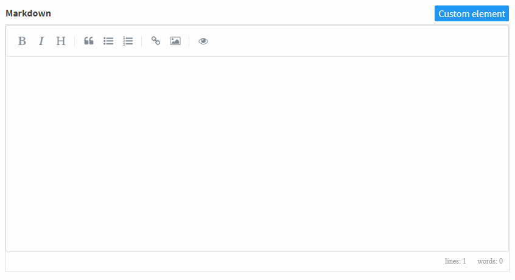

# Markdown

[Markdown editor](https://github.com/Kentico/custom-element-samples/blob/master/Markdown/markdown.html) is a WYSIWYG Custom element which allows users to write formatted text using [SimpleMDE](https://github.com/sparksuite/simplemde-markdown-editor). In this sample element, you can find examples of setting dynamic height and reacting on the window 'resize' events. When the element is disabled, the editor is set to the readonly mode.



This outputs to:
```json
{
    "markdown": {
      "type": "custom",
      "name": "Markdown",
      "value": "# Markdown\nthis is a markdown\n\nList:\n* Item 1\n* Item 2\n\n\t[See google](http://google.com)"
    }
}
```

## Usage

If you want to use the Markdown in your project in Kentico Kontent, follow these steps:

* In Kentico Kontent open Content types tab
* Open / create a content model to which you want to add the Markdown
* Add **Custom element** content element
* Open configuration of the content element
* Use following URL as Hosted code URL (HTTPS): https://kentico.github.io/custom-element-samples/Markdown/markdown.html


