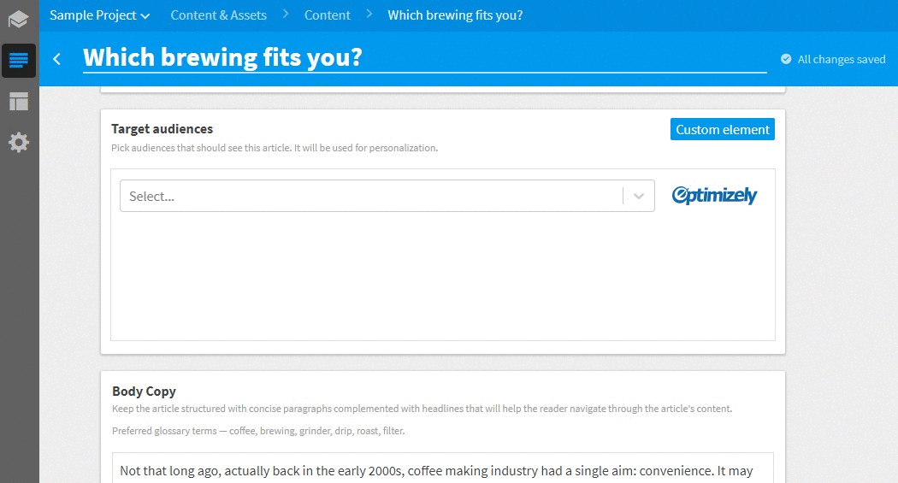

# Optimizely audiences selector
Optimizely audiences selector is a selector connected to Optimizely API which allows users to search and select audiences from Optimizely. When the element is disabled, it only displays the selected audiences.



# Usage

If you want to use the Optimizely audiences selector in your project in Kentico Cloud, follow these steps:

* In Kentico Cloud open Content types tab
* Open / create a content model to which you want to add the Optimizely audiences selector
* Add **Custom element** content element
* Open configuration of the content element
* Use following URL as Hosted code URL (HTTPS): https://kentico.github.io/custom-element-samples/Optimizely/audiences-selector.html
* Provide the following JSON parameters for the custom element to connect it to your Optimizely project, replace the macros with the actual values from Optimizely admin UI

```json
{
    "projectId": "<YOUR PROJECT ID>",
    "apiToken": "<YOUR ACCESS TOKEN>"
}
```

## Example output

The element will save a value containing the array of the selected audiences. 

```json
[
  {
    "id": 14075630105,
    "name": "Caffeine addict"
  },
  {
    "id": 14097300687,
    "name": "Regular drinker"
  }
]
```

# Installation

Optimizely audiences selector source code is in following repository: https://github.com/kenticomartinh/kc-optimizely

If you want to adjust the implementation, first download [Kentico Cloud Custom Elements Devkit](https://github.com/kentico/custom-element-devkit). Source code of this selector needs be positioned within `/client/custom-elements` folder. For further instructions on devkit implementation, please refer to [Custom Element Devkit README](https://github.com/Kentico/custom-element-devkit/blob/master/readme.md).


