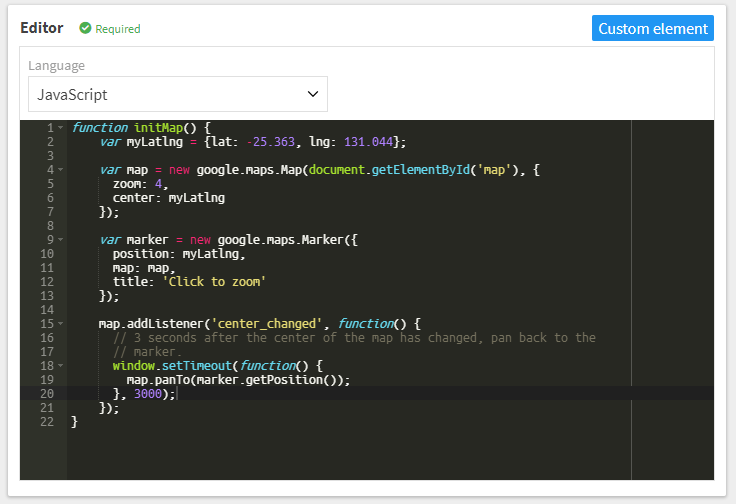

# Syntax Highlighter
Syntax Highlighter is an editable text area enhanced by the [Ace Code Editor](https://ace.c9.io/) to provide a programmer-friendly environment for writing code examples. Offers a fine selection of programming languages to be highlighted.



## Usage

If you want to use the Syntax Highlighter in your project in Kentico Cloud, follow these steps:

* Host the Syntax Highlighter code on you end considering [the Kentico recommendations](https://developer.kenticocloud.com/docs/integrating-content-editing-features)
* In Kentico Cloud open Content types tab
* Open / create a content model to which you want to add the Syntax Highlighter
* Add **Custom element** content element
* Open configuration of the content element
* Use absolute URL of the index.html file hosted on your end as Hosted code URL (HTTPS)
* Optional: Provide the following JSON parameters for the custom element to configure the initial state of the Syntax Highlighter

```json
{
    "initTheme": "<THEME CODENAME>",
    "initMode": "<PROGRAMMING LANGUAGE CODENAME>"
}
```

* **THEME CODENAME** is a filename substring prefixed by **theme-** of a file located in the **ace** folder (i.e. textmate)
* **PROGRAMMING LANGUAGE CODENAME** is a filename substring prefixed by **mode-** of a file located in the **ace** folder (i.e. plain_text)

## Obtaining value

The value contains data about language and code. As Kentico Cloud custom elements can contain only `string` values or `null`, the value is stored as a stringified object. That means the value has to be explicitly parsed. 

### Example

The value contains the following string when obtained from Kentico Cloud:
```
"{\"language\":\"javascript\",\"code\":\"var text = 'Hello world';\"}"
```
You need to parse that value to get a proper object (i.e. in JavaScript with the use of the `JSON.parse` method).

## Original repository

Syntax Highlighter source code is in the following repository: https://github.com/MilanLund/ace-kenticocloud-customelement
